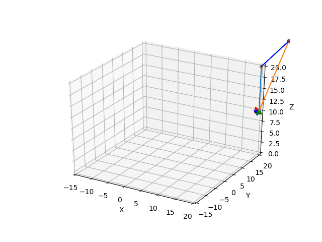

## Readme 

- modified from [this repo](https://github.com/HeYijia/vio_data_simulation)

## frames 

**B**ody frame: imu frame 

**C**am frame: camera frame 

**W**orld　frame: imu frame first pose 

**N**avigation frame: uses ENU, g is $(0,0,-9.81)$

## structure 

main/gener_alldata.cpp: generate data 

src/paramc.h: parameters 

python_tool/: visualization 

## format 

### features 

- x，y，z，1，u，v

- feature id is the order they appear in file 

### imu data

timestamp (1)，imu quaternion(4)，imu position(3)，imu gyro(3)，imu acc(3)

### cam data

- timestamp (1)，cam quaternion(4)，cam position(3)，imu gyro(3)，imu acc(3)

- gyro and acc are useless 

